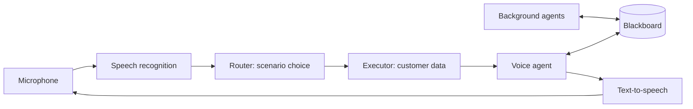

# Voice Router

A contact-center voice bot for the fictional insurance company **Saqta Insurance**.
HackAlem AI, Halyk Bank track, case 2.

The customer speaks into the microphone in Russian, Kazakh, or a mix of both. The bot
understands what they need, picks one of 40 scenarios, answers by voice, and shows the
supervisor why it chose that scenario.

## Why

In a typical voice robot, the scenario is chosen by a classifier trained on fixed
phrases. It breaks when people talk like people: they change the subject, ask for
something on the border between two scenarios, or switch from Russian to Kazakh
mid-sentence.

We pick the scenario with an LLM. The model sees the whole catalog and the conversation
history, so it handles natural speech, and when it is unsure, it asks a clarifying
question or hands off to an operator.

## Running

You need Docker and [just](https://github.com/casey/just).

```bash
cp .env.example .env
just up
```

UI: http://localhost:3000, API and docs: http://localhost:8000/docs.

Without keys the project starts in demo mode: the UI works, but instead of a model
answer you get a clear error (`llm_unavailable`). To enable real models, add to `.env`:

```bash
OPENAI_API_KEY=sk-...
MOCK_MODE=false
LLM_PROVIDER=openai
STT_PROVIDER=openai
TTS_PROVIDER=openai
```

and run `just up` again. Tests: `just test`, router accuracy: `just eval`.

## How it works



1. **Recognition.** The customer holds the button and speaks; on release the recording
   goes straight to the server and is transcribed (`gpt-4o-mini-transcribe`).
2. **Router**: a single LLM request. The prompt contains all 40 scenarios in full, with
   the boundaries between them (`not_this_if`) copied verbatim from the kit. The answer is
   strict JSON: scenario, confidence, reason, alternatives, slots. Confidence ≥ 0.75 — we
   proceed, 0.45–0.75 — we ask to clarify, below that twice in a row — we hand off to an
   operator.
3. **Executor** fetches data: a claim by number, a customer by phone, offices by city.
   Every fact keeps a reference to its source.
4. **Voice agent** answers using only those facts.
5. **Text-to-speech** starts with the first ready sentence; audio streams to the browser
   in chunks.

### The voice doesn't wait for agents

This is the main difference from a typical "run all models first, then answer"
pipeline.

The voice agent answers in short fragments and starts speaking immediately. In parallel,
background agents search the knowledge base and customer data and put what they find on
a shared blackboard. Before each next fragment, the voice agent re-reads the blackboard
and picks up whatever has arrived. Anything that is late makes it into the next turn.

The knowledge-base search starts at the same time as the router, and right after
recognition the bot says a short "One moment, checking". Time to first sound depends
neither on the router nor on how many agents run behind it.

### Why a blackboard rather than a chain of calls

A typical voice bot is a pipeline: recognize → classify → query the database → generate
→ speak. Every new step adds latency, and every new piece of logic is one more link. A
blackboard works differently, and that gives several properties that are hard to get in
a pipeline.

- **Adding logic doesn't slow down the answer.** An agent is a config entry: what it
  reads from the blackboard (`reads`), whose results it depends on (`depends_on`),
  whether it can be waited for and for how long (`blocking`, `deadline_ms`), and whether
  it needs a model or a direct data read is enough (`mode: reader`). New agents run in
  parallel and don't lengthen the path to the first sound.
- **Stale results don't reach the answer.** Every entry carries a call generation and an
  input revision. If the customer interrupts or changes the subject, agent results for
  the old utterance are dropped automatically, with no special handling in each
  scenario.
- **The bot knows what the customer actually heard.** The browser reports how far the
  answer was played. The history stores fragments as heard, partially heard, or not
  heard, and the next answer relies on that, not on what the bot "said".
- **Every statement is traceable.** For each answer fragment we record which blackboard
  version it read and which sources it relied on. The supervisor sees not just "what the
  bot said" but "based on which facts, from which agent, and when they arrived".
- **The router and executor write to the blackboard too.** Scenario, slots, interrupted
  topics, pending confirmations are all shared state. So returning to an interrupted
  topic, asking to clarify, and handing off to an operator with context are not separate
  mechanisms, just blackboard reads.

The practical upshot: for a new company or industry you change the scenario catalog and
the set of agents, not the core code.

## For the supervisor

After each turn the panel shows: what was recognized, which scenario was chosen and why,
alternatives with confidence, extracted data, facts with sources, and the timing of each
stage. The full call history is stored in the database and can be opened by session ID
(`/traces/sessions/{id}`), including tokens per model.

## Results

**Routing.** On 63 of our own utterances (not from the dev set): 62 of 62 correct, in
Russian, Kazakh, and mixed. They include traps on scenario boundaries, topic switches,
attempts to make the bot "approve a payout", and off-topic questions. `just eval` numbers
on the dev set are TODO, to be run before the demo.

**Speed** (live measurements, `gpt-4.1-mini`):

| | now | case target |
|---|---|---|
| scenario choice | 1.5–2.0 s | 0.5 s |
| first sound after recognition | tens of ms (cached acknowledgement) | 1.5 s |
| first substantive word after scenario choice | ~0.8–1.0 s | — |

## Rules the bot doesn't break

- Facts only from data, each with a source. The model phrases, it doesn't invent.
- Nothing irreversible without the customer's explicit confirmation.
- Never promises a payout, a refund, or a policy issuance — hands off to an operator
  together with the conversation context.
- When unsure, it asks instead of guessing.

## Limitations

- The router is still slower than the 0.5 s target.
- With models enabled, customer utterances are sent to OpenAI. The kit data is fictional,
  but a real contact center would need PII masking or a self-hosted model.
- No fast path for obvious requests: every utterance goes through the LLM.
- SMS and operator handoff are stubs.
- Single backend process: an unfinished turn doesn't survive a restart (the history
  does).
- We tested Kazakh ourselves, not with a native speaker.

## What's next

- A fast path for obvious phrases, LLM only for hard ones. Cheaper and faster.
- Telephony instead of the browser.
- Supervisor analytics: where the bot asks again or makes mistakes, what to fix in the
  catalog.
- Other companies and industries: the scenario catalog is data and can be edited via
  `/kit` without a developer.
- A self-hosted model for companies that can't send data outside.

## Repository layout

```
backend/app/     call, speech, router, executor, kernel, context, knowledge, tracer
frontend/src/    call screen, history, scenario catalog, tracing
datasets/        starter kit, unchanged
docs/adr/        architecture decisions
docs/specs/      module specifications
```

Decisions are in [`docs/adr/`](docs/adr/), the main specification is
[`docs/specs/voice-router-spec.md`](docs/specs/voice-router-spec.md), and team working
rules are in [`AGENTS.md`](AGENTS.md).

## Technologies and approaches

**Stack**
- Backend: Python 3.13, FastAPI, Pydantic v2, SQLAlchemy async, Alembic, uv
- Frontend: Next.js (App Router), React, TypeScript, Web Audio API, MediaRecorder
- Data: PostgreSQL + pgvector, full-text and trigram search
- Models (OpenAI): `gpt-4.1-mini` — router and answer, `gpt-4o-mini-transcribe` / `gpt-4o-transcribe` — recognition, `gpt-4o-mini-tts` — speech, `text-embedding-3-large` — search
- Infrastructure: Docker Compose, just, OpenTelemetry

**Approaches**
- LLM router instead of a classifier: the whole catalog in the prompt, strict JSON output, confidence thresholds, clarification and operator handoff
- Blackboard architecture: shared versioned call state, the voice agent and background agents run in parallel
- End-to-end streaming: turn events over SSE, answer in fragments, TTS in PCM chunks, acknowledgement before routing
- Parallel work: knowledge-base search runs concurrently with the router
- Hybrid RAG: lexical + vector search with rank fusion, query expansions for Kazakh
- Router prompt cache and embedding/search result cache
- Facts only from data with `source_id`, confirmation of irreversible actions, PII masking before sending to the model
- OpenTelemetry tracing of every turn: stages, latencies, tokens per model
- Modular backend with layers and automatic dependency-direction checks
- Keyless mode: the project starts and honestly shows what is missing
